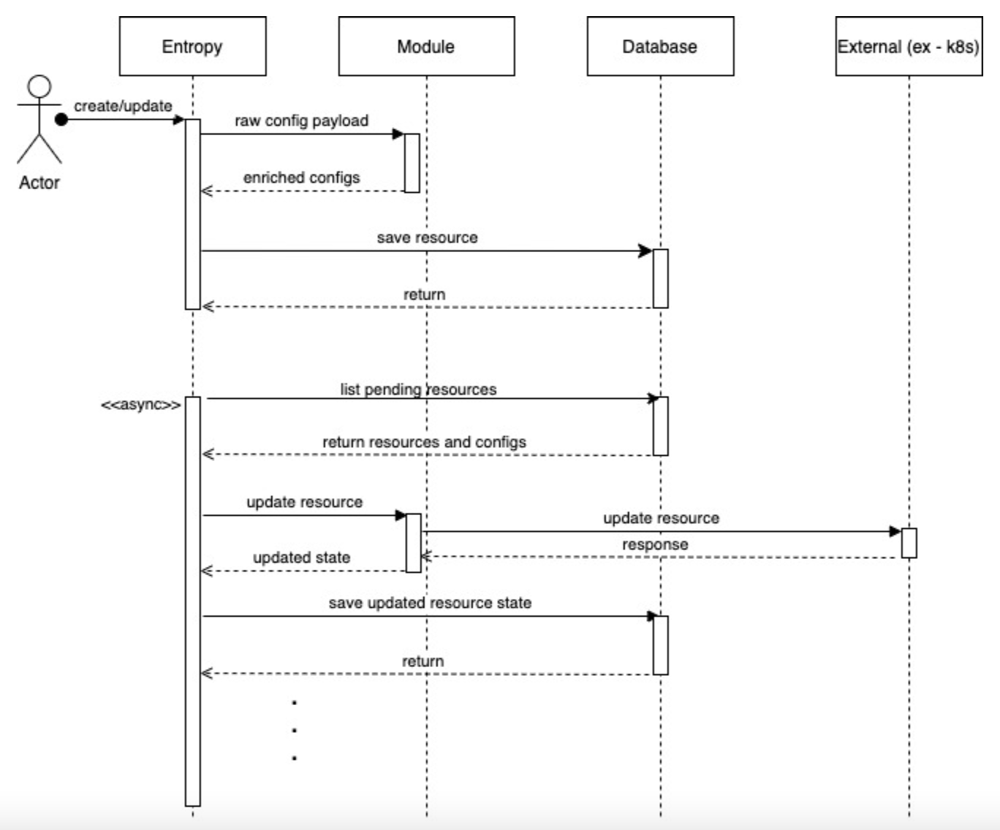

# Architecture

This document describes the high-level architecture of Entropy to enable anyone interested in contributing understarnd it's flow quickly.

## Flow of logic

First let's have a bird's eye view on how the logic flows in Entropy. This diagram below will give you a high-level understanding of how an action performed by an Actor interacts with various components of Entropy.



Now, let's discuss what happends in each of the action above one by one.

 - 1: Entropy's `core` interacts with the Module, to sanitise and validate the raw configuration. This also includes the `Plan` phase of resource life cycle, which attaches all the pending actions to the resource.
 - 2: Next, is an interaction with the `Database`, where the resource is saved.
 - 3: Now, all the resources with a status pending, are picked up from the Database.
 - 4: Entropy `core` again interacts with the respective `Module`, to trigger the `Sync` phase of the resource life cycle. A `job-queue model` is used to handle sync operations. In this part, Module can call external APIs.
 - 5: The updated state returned by the Module in the previous step is saved in the Database. 

Note: The actor can interact with the core either through APIs call or using Entropy's CLI.

## Code Layout

Here is how the basic layout of Entropy looks like:

```
+ entropy
|--+ cli/
|  |--+ serve.go                 {Load configs, invoke server.Serve()}
|  |--+ migrate.go               {Load configs, execute store migration}
|--+ core/
|  |--+ resource/
|  |  |--+ resource.go                 {Resource type, Store iface, pure functions on Resource}
|  |  |--+ state.go                  
|  |--+ module/
|  |  |--+ module.go                   {Module iface, module related Error types}
|  |  |--+ module_ext.go
|  |  |--+ action.go  
|  |  |--+ registry.go     
|  |--+ mocks/            
|--+ modules/
|  |--+ firehose/                       {Module implementation}
|  |--+ kubernetes/                     {Module implementation}
|--+ pkg/
|  |--+ errors/                         {Custom errors, with Code, Cause and message}
|  |  |--+ errors.go 
|  |--+ helm/                           {Helm client and APIs}
|  |  |--+ cliet.go 
|  |  |--+ kube_rest.go 
|  |  |--+ release.go 
|  |  |--+ status.go 
|  |--+ kube/                           {Kubernetes client and APIs}
|  |  |--+ client.go 
|  |  |--+ config.go 
|  |--+ logger/
|  |  |--+ logger.go 
|  |--+ metric/
|  |  |--+ metric.go 
|  |--+ version/
|  |  |--+ version.go 
|  |--+ worker/                         {Worker Implementation}
|  |  |--+ example/
|  |  |--+ mocks/
|  |  |--+ pgq/
|  |  |--+ worker.go
|  |  |--+ worker_option.go
|  |  |--+ job.go  
|--+ internal/
|  |--+ server/
|  |  |--+ v1/
|  |  |  |--+ server.go             {Resource CRUD handlers}
|  |  |  |--+ mappers.go             {Resource CRUD handlers}
|  |  |--+ server.go                {Server setup, Serve() function, etc.}
|  |--+ store/
|  |  |--+ postgres                  {Implement resource.Store, module.Store using Postgres}
|--+ docs/
|--+ main.go                        {Setup cobra+viper & add commands}

```

***Some highlights:***

Domain oriented packages are inside `core/` (resource and module)

`internal/` for keeping packages that should not be imported by any other projects (e.g., server, store, etc.)

`pkg/` for truly reusable (independent of entropy specific things) packages.

Mocks for interfaces are defined close to the interface definition in an isolated `mocks/` package insede `core/`.